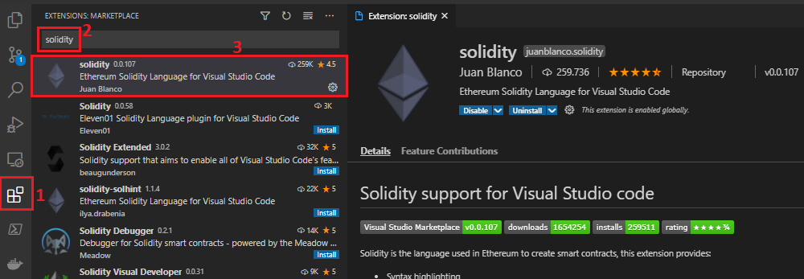
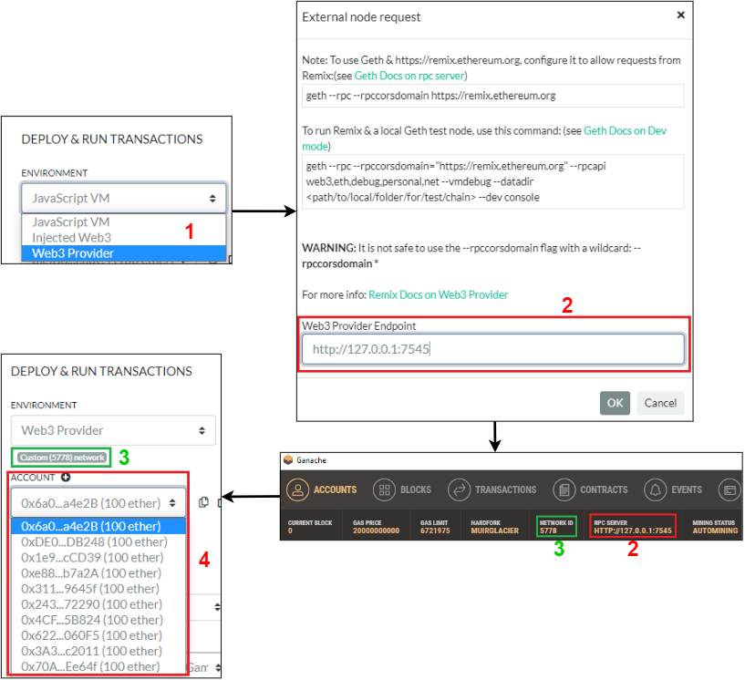
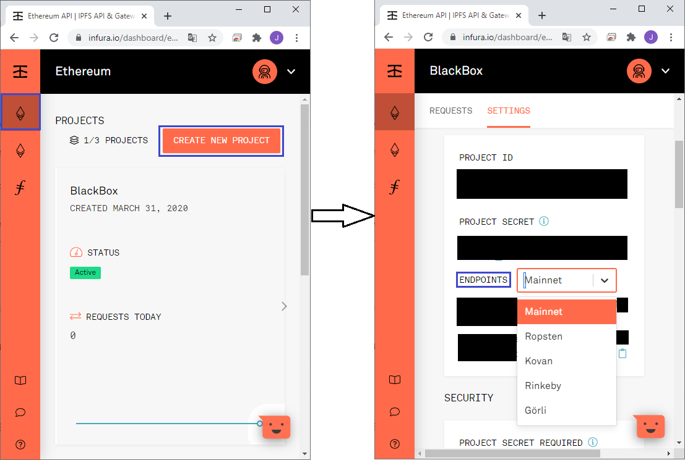
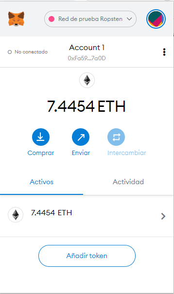
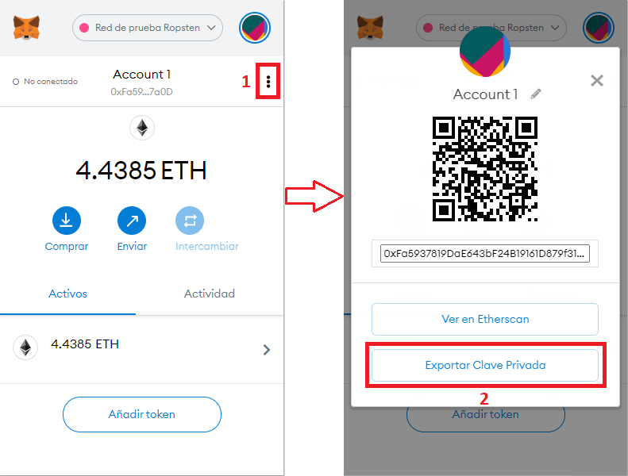
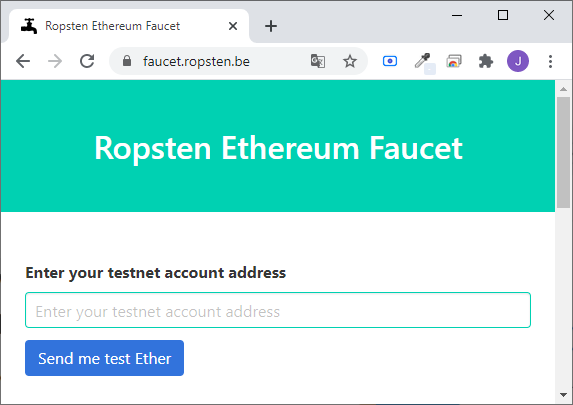

# Ethereum Fundamentals
In this guide you will learn how to write, compile and deploy a smart contract into Ethereum mainnet or any of its testnets.

## Smart Contracts
A smart contract is a collection of code and data that resides at a specific address on the Ethereum blockchain network. Smart contracts are also a specific type of Ethereum account (they have balance and they can send transactions). However, they're not controlled by a user: they are deployed to the blockchain network and run as programmed. Users (with their Ethereum accounts) can interact with smart contracts by submitting transactions that execute functions defined on those smart contracts.

To deploy a contract to a Ethereum blockchain network it is necessary (apart from writting the contract itself) to have enought ether (ETH) on your account to carry out this operation. Deploying a smart contract is also a transaction, like a simple ETH transfer, so you will need to pay an amount of gas for contract deployment. There are two main programming languages for writting smart contracts: Solidity (similar to JavaScript) and Vyper (similar to Python). In this guide we will focus on smart contract programming using Solidity.

### Solidity
Solidity is an object-oriented, high-level language for implementing smart contracts. It has being designed to target the Ethereum Virtual Machine (EVM), is statically typed, supports inheritance, libraries and complex user-defined types (among other features). After writing a smart contract and before deploy it to a blockchain network, it is mandatory to compile that contract. There are multiple ways to install/use Solidity compiler: npm, Docker, Linux packages, macOs packages, binaries or building from source. I recommend using __npm / Node.js Solidity compiler__ because it is the easiest alternative. To install it execute `npm install -g solc` on your favourite terminal. After installation verify using `solcjs --version`.

In order to present Solidity main features, directory [examples](./examples) includes a series of smart contracts that use some of those characteristics.

### Ethereum Virtual Machine (EVM)
The Ethereum Virtual Machine or EVM is the runtime environment for smart contracts in Ethereum. It is completely isolated, which means that code running inside the EVM has no access to network, filesystem or other processes. Smart contracts even have limited access to other smart contracts. EVM key points will be exposed down below:
* ___Accounts___. There are two types of accounts in Ethereum: __external__ and __contract__. The former type is controlled by public-private pair (i.e. humans), while the latter is controlled by the code stored together with the account. Both kinds of account are treated equally by the EVM. Furthermore, every account has a __balance__ in Ether (exactly in Wei, where `1 ether = 10^18 wei`) which can be modified by sending transactions including Ether.
* ___Transactions___. A transaction is a message that is sent from one account to another and it can include binary data (called payload) and Ether. If the target account is a contract account, its code is executed and the payload is provided as input data. If the target account is not set, the transaction creates a __new contract__.
* ___Gas___. When creating a transaction, this one is charged with a certain amount of __gas__. Gas purpose is to limit the amount of work that is needed to execute the transaction and to pay for this execution at the same. Moreover, the __gas price__ is set by the creator of the transaction, who will have to pay `gas_price * gas` up front from the sending account. If some gas is left after execution, it will be refunded to the transaction creator.
* ___Storage, memory and the stack___. The EVM has three areas where it can store data:
  * __Storage__. This area is persistent between functions calls and transactions. Furthemore, it is the most expensive area (talking in terms of gas consumption) since it is costly to read, and even more to initialise and modify. Because of this cost, it is highly recommended to minimise saving data in persistence storage.
  * __Memory__. The second area is freshly cleared for each message call. It is not a persistent area and is more costly the larger it grows (at the time of expansion, the cost in gas must be paid).
  * __The stack__. The EVM is not a register machine but a stack machine, so all computations are performed on a data area called the stack.

## Development environments

### Remix
For newcomers it is highly recommended to start programming Solidity using __Remix__. Remix IDE is an open source web and desktop application that allows a fast development cycle and has __a rich set of plugins__ with intuitive GUIs. Remix is used for the entire journey of smart contract development as well as being a playground for learning and teaching Ethereum. It includes editor, compiler and debugger (among other features) in one single site/app. 

It is written in JavaScript and, as said previously, supports both usage in the browser and in the desktop. To try web application visit [https://remix.ethereum.org](https://remix.ethereum.org), and for desktop version, check latest releases on [ethereum/remix-desktop GitHub repository](https://github.com/ethereum/remix-desktop/releases). For further details, please consult [this tutorial](tutorials/remix.md) covering Remix IDE key points.

### Truffle Suite
It is a blockchain development suite (probably the most popular one). Currently it it composed by 4 tools/projects:
* __Truffle__. A development environment, testing framework and asset pipeline for blockchains using the Ethereum Virutal Machine.
* __Ganache__. A personal blockchain for Ethereum development that can be used to deploy contracts and/or develop applications.
* __Drizzle__. A collection of front-end libraries that make writing dapp front-ends easier. It includes libraries to simplify dapps development in plain JavaScript, React and Vue.
* __Truffle Teams__. It is a DevOps tool for Dapps that allows testing efficiently with hosted continous integration or monitoring deployed contract balances, transactions and events.

All these four libraries are great, but the most interesting one for us is __Ganache__, the one click blockchain. It is available as both a desktop application as well as a command-line tool. On the one hand, __Ganache UI__ (or just Ganache) is a desktop application supporting Ethereum technology. On the other hand, __ganache-cli__ is the command line version of Ganache, which can be dowloaded through _npm_ (`npm install -g ganache-cli`). All versions of Ganache are available for Windows, Mac and Linux. A [simple Ganache tutorial](tutorials/ganache.md) has been written as a starting point using this tool.

### Visual Studio Code
Also known as VS Code, Visual Studio Code is a lightweight but powerful source code editor which runs on your desktop and is available for Windows, macOS and Linux. It comes with built-in support for JavaScript, TypeScript and Node.js, having also a rich set of extensions for other languages such as Java, Python, C# or __Solidity__. In order to install VS Code, please check [Visual Studio Code dowloads site](https://code.visualstudio.com/download), where you can find the VS Code version that fits better on your computer.

After installing it (or if you had it already installed), select 'Extensions' tab (1 in image below), search the desired extension writing _solidity_ on the text box (2 in image below) and install the extension developed by Juan Blanco (3 in image below). As at 2nd March 2021, it is also the Solidity extension with more downloads.

## Deploying smart contracts
There are multiple ways to deploy a smart contract in a blockchain network. In this section, we will learn __how to deploy a contract in a Ganache network__ using Remix IDE and using web3.js JavaScript library. In both cases is mandatory having a Ganache network running.

### Using Remix IDE
It is the easiest and fastest way to deploy a smart contract. First, Select __Deploy & Run Transactions__ Remix plugin. Then, choose __Web3 Provider__ environment (1 in image below) and a modal dialog will be prompted. It will require a Web3 Provider Endpoint, which is the __Ganache RPC Server URL__ (2). After entering endpoint, below environment select box, __network id__ is shown (3). Also, Ganache accounts are displayed (4).

Now, you can deploy a smart contract in your Ganache blockchain network with any of your accounts.

### Using web3.js
web3.js is a JavaScript library that allows you to interact with a local or remote Ethereum node through HTTP(s), IPC or WebSockets. It has multiple installation ways: Node/npm, Yarn, using the prebuilt JavaScript file or through a CDN. A quick tutorial indicating how to deploy a smart contract and how to interact with it using web3.js is [here](examples/06-web3js/README.md).

__Note:__ It has been used web3.js as it could be used Web3 library for Java ([web3j](https://github.com/web3j/web3j)), Python ([web3.py](https://github.com/ethereum/web3.py)) or Ruby ([ethereum.rb](https://github.com/EthWorks/ethereum.rb)).

## Deploying in testnets
Before starting this section, please read the previous one.

Deploying a smart contract in a Ethereum testnet is quite similar that doing it in our local Ganache network. Nevertheless, it has two additional requirements: a way to interact with the desired network (__Infura__ or __Metamask__) and valid ether from that network (they can be obtained through a __faucet__)

### Infura
It is a development suite that provides instant and scalable API access to the Ethereum networks. Using Infura requires an account in their system. You can [register on Infura for free](https://infura.io/register).

Once your registration has been completed, you can create an Ethereum project on Infura. First, click on Ethereum tab and press button _CREATE NEW PROJECT_. After project creation, it will appear in your dashboard. Click on it and select tab _SETTINGS_, where you can find endpoints for Mainnet and some Testnets (Ropsten, Kovan, Rinkeby y Görli). Copy one of those endpoint URLs and use it to interact with the desired network.

### Metamask
Metamask is an extension for accessing Ethereum network in several browsers as Chrome, Firefox, Brave or Edge. The extension injects the Ethereum web3 API into every website's javascript context, so that dapps can read from the blockchain. It can be dowloaded [here](https://metamask.io/download.html) and it looks like this:

It is also possible to connect your Metamask wallet with Remix IDE. Go to _DEPLOY & RUN TRANSACTIONS_ plugin and select a __Injected Web3__ environment. A Metamask window will be automatically prompted asking for permission. 

### Faucets
A Ethereum Faucet is an online platform that rewards users with small amounts of ether for completing microtasks or viewing online ads. However, testnets faucets do not require any of these, since that ether is worthless and only valid for testing purposes. For instance, [faucet.ropsten.be/](https://faucet.ropsten.be/) is a Ropsten faucet that send one ether to the account you enter, as shown down below:

## Deploying in the mainnet
Before starting this section, please read the previous one.

Finally, to deploy a smart contract in Ethereum mainnet you need real ether. When deploying a contract in this network, it must be tested several times beforehand. Executing transactions should be also limited, since each one consumes gas, with an associated expenditure of money.

The steps to follow should be the same as for the deployment in testnets: write the smart contract, compile it with Remix/Solidiy compiler and deploy it using web3.js library+Infura or Remix+Metamask.

### Some Links
[Solidity Documentation](https://docs.soliditylang.org/)

[Vyper Documentation](https://vyper.readthedocs.io/)

[Solidity Tutorial](https://www.tutorialspoint.com/solidity/)

[Installing the Solidity Compiler](https://docs.soliditylang.org/en/v0.8.1/installing-solidity.html#installing)

[The Ethereum Virtual Machine (EVM)](https://docs.soliditylang.org/en/v0.8.1/introduction-to-smart-contracts.html#the-ethereum-virtual-machine)

[Remix - Ethereum IDE](https://remix.ethereum.org/)

[Truffle - Smart contract development environment](https://github.com/trufflesuite/truffle)

[Ganache - A one click blockchain](https://www.trufflesuite.com/docs/ganache/overview)

[Visual Studio Code](https://code.visualstudio.com/)

[web3.js - Ethereum JavaScript library](https://web3js.readthedocs.io/en/v1.3.4/)

[Infura - Ethereum APIs](https://infura.io/)

[Metamask - Crypto wallet & gateway to blockchain apps](https://metamask.io/)