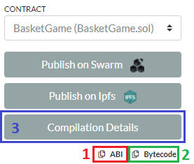

# Web3.js

In this example we are going to deploy a smart contract in a Ganache blockchain network and to interact with that contract. For this purpose, web3.js JavaScript library and the latest version of [BasketGame.sol](../05-mapping/BasketGame.sol) will be used.

## Adding the library
Initialise a new Node project
```bash
npm init -y
```

And install the library
```bash
npm i web3
```

## Deploy a smart contract
To deploy and interact with a smart contract __web3.js__ provides the object `web3.eth.Contract`. When creating a new contract object the __JSON interface__ of the respective smart contract is required. Also named __Contract ABI (Application Binary Interface)__, this interface is the standard way to interact with smart contracts in the Ethereum ecosystem, where data is encoded according to its type.

But, how can I get my contract's ABI? The answer is not how, but where: Remix IDE. Go to Remix (browser or desktop version, it does not matter), open the contract in the editor, compile it and select __Solidity Compiler__ plugin. Now, click button __ABI__ (1 in image below) and contract JSON interface will be copied into your clipboard. With the ABI, it is possible to create a new contract instance as follows: `new web3.eth.Contract($ABI_COPIED)`, where `$ABI_COPIED` is the contract interface just copied on Remix.



That is enough to create a smart contract instance. However, in order to deploy it to the network, one more thing is needed: the __contract bytecode__, which is the code that will be stored on-chain and describes the smart contract. Again, Remix IDE provides this bytecode (2 in image above). Now it possible to call function `deploy`, which needs the bytecode and contract arguments (we have zero arguments in our smart contract).

```js
myContract.deploy({
  data: '0x12345...',
  arguments: []
})
```

Nevertheless, Remix IDE provides an utility that auto-generates all contract deployment code. Clicking on button __Compilation Details__ (3 in image above) prompts a modal dialog showing lots of information about compilation. The most interesting one is called __WEB3DEPLOY__, which allows user to copy the necessary code to deploy the smart contract using web3.js.

Summing up, the code necessary to deploy a smart contract using web3.js library is the code shown below:
```js
const Web3 = require('web3'); // Import web3 library

const web3 = new Web3("http://localhost:7545"); // Create a Web3 instance
const basketgameContract = new web3.eth.Contract($ABI_COPIED); // Create contract instance
basketgameContract.deploy({ // Deploy contract
  data: '0x12345...', // Use Remix IDE bytecode
  arguments: []
}).send({
    from: web3.eth.accounts[0], 
    gas: '4700000'
  }, function (e, contract){
    console.log(e, contract);
    if (typeof contract.address !== 'undefined') {
      console.log('Contract mined! address: ' + contract.address + ' transactionHash: ' + contract.transactionHash);
    }
});
```

Finally, you can execute the JavaScript file:
```bash
node deploy.js
```

## Interact with a smart contract
In a similar way, interacting with a contract throught web3.js library requires an instance of the desired contract. In this case, it also needs the address where the contract is deployed: `new web3.eth.Contract($ABI_COPIED, $CONTRACT_ADDRESS)`. Once contract instance is created, you can interact with the contract using methods `send` (for functions that do change contract state) and `call` (for functions that do not change contract state, 'view' functions).

```js
const Web3 = require('web3'); // Import web3 library

const web3 = new Web3("http://localhost:7545"); // Create a Web3 instance
const basketgameContract = new web3.eth.Contract($ABI_COPIED, $CONTRACT_ADDRESS); // Create contract instance

// Now you can try contract functions

// 1. Create a new game
basketgameContract.methods.createGame("UNICAJA", "BASKONIA")
  .send({from: web3.eth.accounts[0]})
  .then(function(response){
    console.log(response); // It will return game id
  });

// 2. Check game result ('from' is not mandatory but recommended when using 'call')
basketgameContract.methods.getResult(1)
  .call({from: web3.eth.accounts[0]})
  .then(console.log);
```

Edit `interact.js` as you like and the execute it:
```bash
node interact.js
```

### Useful links
[web3.js - Contract object](https://web3js.readthedocs.io/en/v1.3.4/web3-eth-contract.html)