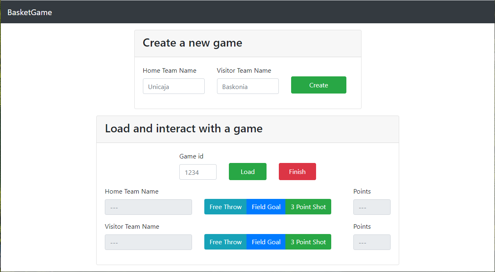

# Dapp

After learning how to write a smart contract using Solidity and how to deploy it on a blockchain network using web3.js library, in this last example we will create our first Decentralised APPlication (DAPP). There is nothing much to explain about a DAPP: it is just an application running on a distributed network (in our case, a blockchain network).

As the latest version of [BasketGame.sol](../05-mapping/BasketGame.sol) was already deployed in the previous example, now we are going to create a user interface to interact with the smart contract.

Again, it is necessary to make use of the web3 library. However, in this case the library will be include in a html file. In order to check out the developed Dapp, open in a browser file [index.html](index.html). It looks like this:

The JavaScript file using web3.js library ([main.js](main.js)) needs to change variables `$ABI_COPIED` and `$CONTRACT_ADDRESS` to work properly. Please change both before running the Dapp.