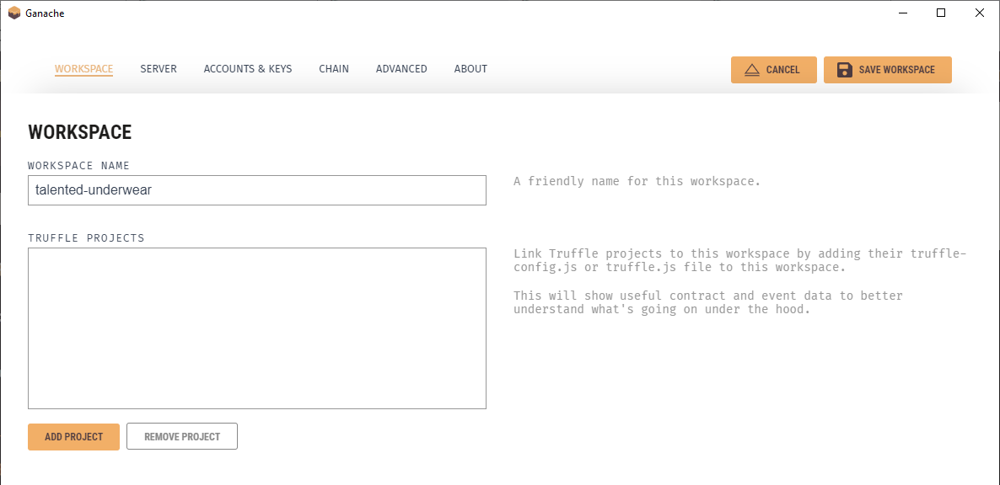

# Ganache UI tutorial
After installing Ganache desktop and executing it for the first time, home screen will appear. Here user can load an existing workspace (if any exists), create a new custom workspace, or quickstart a blockchain with default options.


The __quickstart workspace__ starts with the below detailed options:

```bash
Hostname: 127.0.0.1 - localhost
Port Number: 7545
Network ID: 5777
Automine: true
Error on Tx Failure: true

Account Default Balance: 100
Total Accounts to Generate: 10
Autogenerate HD Mnemonic: false
Lock Accounts: false

Output Logs to File: false
Verbose Logs: false
```

When creating a new __custom workspace__ users can configure above mentioned options through a UI. __Editing an existing workspace__ will display same screen too.



After starting the configured blockchain, screen shown down below will appear. The main screen always includes an upper navigation bar, which is composed by __a set of modules/tabs__ (1 in image below), __information about the blockchain__ (2), __workspace name__ (3), a button to __change the workspace__ (4), and a button to __edit the configuration__. Depending on the selected module, the content displayed on the __main panel__ (6 in image below) will change. For instance, if tab _Accounts_ is selected, a list with all existing account will be shown in the main panel.


