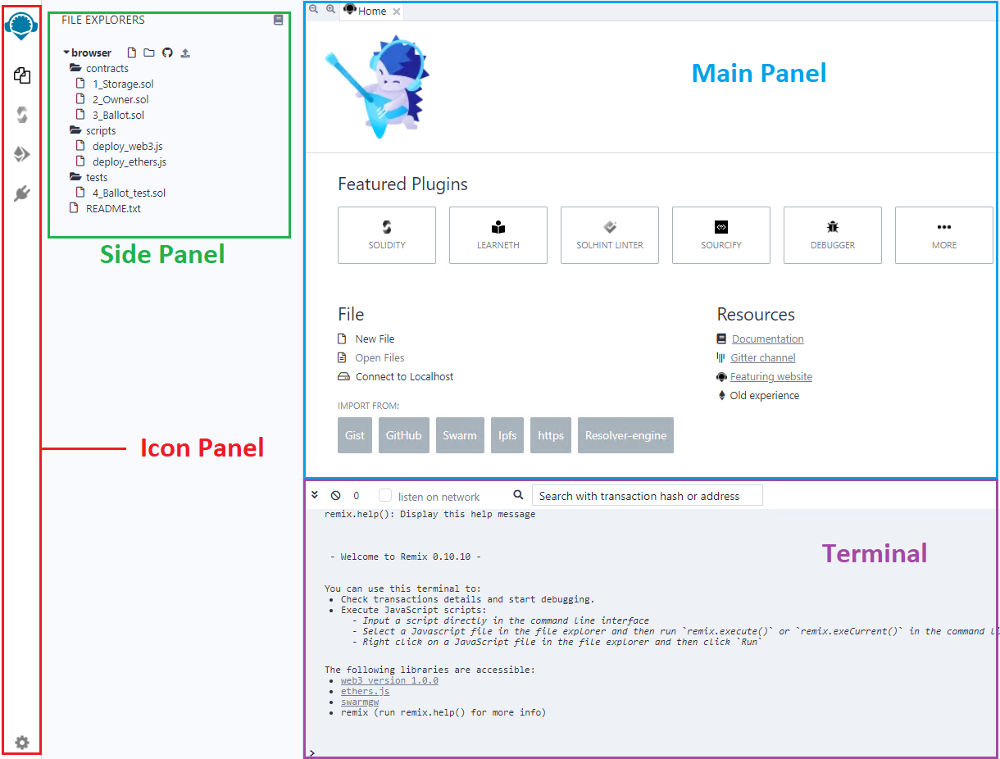
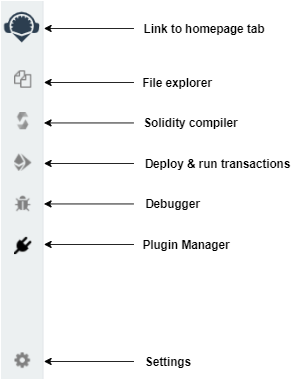
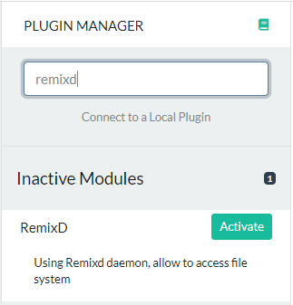
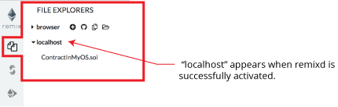
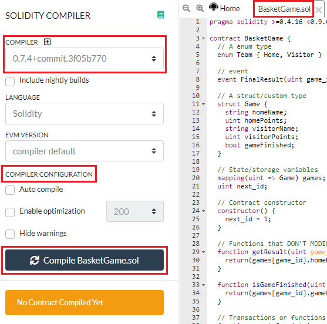
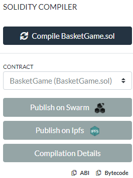
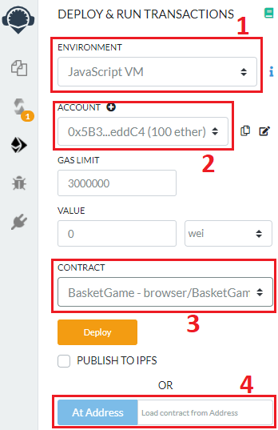
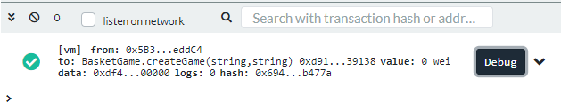
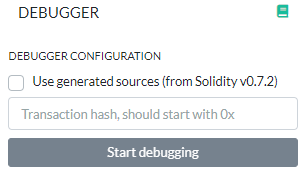
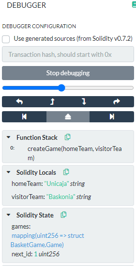

# Remix IDE tutorial
In this tutorial Remix IDE main features will be explained using the browser version. First of all, go to [https://remix.ethereum.org](https://remix.ethereum.org).

## Structure

Remix IDE Layout is divided in four main areas:
* __Icon Panel__. Click to change which plugin appears in the Side Panel.
* __Side Panel__. Most but not all plugins will have their GUI here.
* __Main Panel__. Here you can have opened several tabs. In the tabs can be files for the IDE to compile or homepage (tab 'Home' displayed on screenshot above), which allows you to select plugins or to create/open/import files, among other features.
* __Terminal__. Where results of interactions with the GUI's will be shown. Also you can run scripts here.

When you load Remix for the very first time, the Icon Panel will show at least four icons: Link to homepage, File explorer, Plugin Manager and Settings. As everything in Remix is a plugin, the __Plugin Manager__ is really important. In the other hand, __Settings__ allows user to configure general settings, to include a GitHub access token (in order to retrieve GitHub contents) and to choose the desired theme to work on Remix.

Apart from above mentioned plugins, I strongly recommend adding a few more to ease the smart contract development: __Solidity compiler__, __Deploy & run transactions__ and __Debugger__. The optimal configuration is shown in the next screenshot.

## File explorer
File explorer lists all the files stored in your __browser's storage__ under folder __browser__. It is important to note that clearing the browser storage will __permanently delete__ all files stored there. This is a limitation of a browser-based IDE. Despite this, it is possible to store files outside the browser and on your computer's filesystem using __remixd__, which is a npm module that enables you to have access to a selected folder on your disk.

To install remixd execute command `npm i -g remixd`. Then, use command `remixd -s <absolute-path-to-the-shared-folder> --remix-ide https://remix.ethereum.org` to link the desired folder to Remix browser IDE through a websocket connection. After the command is running, is necessary to active the remixd plugin __from Remix IDE__, in the Plugin Manager.

This is a websocket plugin and it has no UI other a modal dialog box, which will ask for confirmation. Accepting this dialog will start a session. __NOTE: you need to install remixd npm module and run its command before activating the plugin__. After this, your connection to the remixd daemon should be successful. The shared directory will be available in the file explorer, under folder __localhost__

## Plugin Manager
Controlling which plugins are active or inactive occurs in the Plugin Manager. This plugin architecture has made it possible to integrate tools made by the Remix team with tools made by external teams.

Plugin Manager is truly simple and easy to use. It is possible to search plugins, activate/deactive them and see permissions granted to those plugins if they have.

## Solidity editor
The Remix editor recompiles the code each time the current file is changed or another file is selected. It also provides syntax highlighting mapped to solidity keywords.

## Solidity compiler
Compiling is triggered when you save a contract (`crtl + s`) or when _Compile Contract.sol_ is pressed (the desired contract must be opened in the Main Panel). The most import thing in this plugin is to choose an appropiate compiler version. It is also possible to make some configuration arrangements like hide warnings or enable optimization.

After contract compilation, a few new buttons will appear. The most intersting one is __Compilation Details__, where lots of useful information appears.

## Deploy & run transactions
This module allows you to send transactions to the current environment. To use it, you need to have a contract compiled. So, if nothing is there in the __Contract__ select box (3 in image below) or desired contract is not on the list, you need to make active a contract (selecting it) in the editor, go to __Solidity compiler__ and, finally, come back to Deploy & Run.

When at least one contract is compiled, it is possible to select it (3 in image above) and deploy in the desired environment (1 in image above) with the chosen account (2 in image above). There are 3 kinds of environments, whose characteristics are going to be explained:
* __JavaScript VM__. All the transaction will be executed in a sandbox blockchain within the browser and thus nothing will be persistend when you reload the page. It has 15 accounts, each of which has 100 ETH.
* __Injected Provider__. Remix will connect to an injected web3 provider. The most famous provider that injects web3 is __Metamask__.
* __Web3 Provider__. Remix will conneect to a remote node. You will need to provide the URL to the selected provider.

There is also the possibility to work with a pre-deployed contract. For this it is necessary to input a contract address in the __At Address__ text field (4 in image above) while having contract source code in the editor.

## Debugger
The Debugger shows the contract’s state while stepping through a transaction. It can be used on transactions created on Remix or by providing a transaction’s address. The latter assumes that you have the contract’s source code or that you have input the address of a verified contract.

There are to ways of starting a debugging session:
* In the terminal when a transaction is executed, a __Debug__ button appears. Clicking on it will activate the debugger and it will gain focus in the Side Panel.

* Going straight forward to the Debugger through its button in the Icon Panel. To start the debugging session, input the address of a deployed transaction (while having the source code in the editor) and then click the __Start debugging__ button.

The debugger will highlight the relevant code in the editor. If you want to go back to editing the code without the Debugger’s highlights, then click the __Stop Debugging__ button.

### Useful links
[remixd](https://remix-ide.readthedocs.io/en/latest/remixd.html)

[Solidity Compiler on Remix](https://remix-ide.readthedocs.io/en/latest/compile.html)

[Metamask](https://metamask.io/)

[Deploy & Run on Remix](https://remix-ide.readthedocs.io/en/latest/run.html)

[Debugger on Remix](https://remix-ide.readthedocs.io/en/latest/debugger.html)
