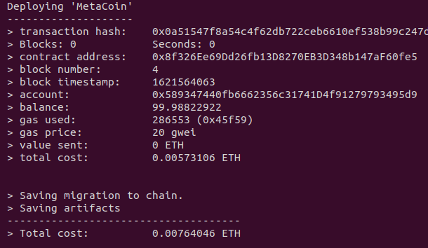

# Truffle tutorial
Apart from the tool itself, Truffle requires a running Ethereum client which supports the standard JSON RPC API. There are several clients, but in this tutorial we will be using **Ganache**.

## Creating a project
To use Truffle commands, it is necessary to run them inside an existing Truffle project. So the first step is to create a new project. There are two options when creating a Truffle project:
- `truffle init`. A bare Truffle project with no smart contracts included will be created.
- `truffle unbox <box-name>`. First of all, to understand the function of this command, it is necessary to explain what a Truffle Box is. **Truffle Boxes** are boilerplates that, in addition to Truffle, may contain other helpful modules, Solidity contracts, front-end views and more. Thus, the command `unbox` will download a Truffle Box, a pre-build project.

No matter what option you choose, the structure of the project will have the following items:
- `contracts/`: Directory for Solidity contracts.
- `migrations/`: Directory for deployment scripts (JavaScript files).
- `test/`: Directory for testing files.
- `truffle-config.js`: Truffle configuration file. We could say it is similar to the _package.json_ file in a Node.js project. This file can execute any code necessary to create your configuration. In the next subsection we will learn how to customize it.

Before moving into the next sections, we need to create the Truffle project. In this guide we are going to use a Truffle Box, in particular **Metacoin** box. To install it, execute `truffle unbox metacoin`.

## Customizing `truffle-config.js` file
This file must export an object representing your project configuration like the example below:

```js
module.exports = {
  networks: {
    development: {
      host: "127.0.0.1",
      port: 8545,
      network_id: "*" // Match any network id
    }
  }
};
```
This example is the default configuration that Truffle uses if the **networks** object is empty: a single development network running on `127.0.0.1:8545`. Thus, file above is equal to:
```js
module.exports = {
  networks: {

  }
};
```

The `networks` object is composed by a set of network configuration objects, keyed by a network name. This option **is required**, as if you have no network configuration Truffle will not be able to deploy the contract. To configure Truffle to connect to different networks, you have to included more named networks and specify the corresponding network id.

In our case, we will add 2 networks: a **Ganache network** for local development and the **Ropsten network** for testing. To interact with Ropsten, Ethereum mainnet or any other testnet, it is highly recommended using Infura, which need a wallet provider to sign transactions. For instance, `@truffle/hdwallet-provider`. To install this npm package, go to the root directory of your Truffle project and execute command `npm install @truffle/hdwallet-provider`. Now, we can define our networks:
```js
// Import wallet provider library
const HDWalletProvider = require('@truffle/hdwallet-provider');

module.exports = {
  networks: {
    ganache: {
      host: "127.0.0.1",
      port: 8545,
      network_id: "*",
    },
    ropsten: {
      // It is importatnt to wrap the provider as a function.
      provider: () => {
        return new HDWalletProvider({
          privateKeys: [$YOUR_ACCOUNT_PRIVATE_KEY],
          providerOrUrl: `https://ropsten.infura.io/v3/${$YOUR_INFURA_PROJECT_ID}`
        });
      },
      network_id: 3, // Ropsten network id
      gas: 5500000,        // Ropsten has a lower block limit than mainnet
    }
  }
};
```

## Compiling smart contracts
With a empty Truffle project created using `truffle init`, folder `contracts/` only contains `Migrations.sol` file, which helps in the deployment process (it is not an application contract). But we are using a Truffle Box and we have some contracts in that folder.

To compile a Truffle project, change to the root directory of the project and execute command `truffle compile`. The first time all contracts will be compiled. However, on subsequent runs, Truffle will compile only the contract that have changed since the last compile. To avoid this behaviour, run the command including `-all` option.

Artifacts of compilation are stored under folder `build/contracts/`. The name of generated artifact JSON files reflect the name of the contract definition. These artifacts are integral to the inner workings of Truffle and they **should not be modified**.

## Running migrations
After compiling your contracts, it is time to deploy them on a Ethereum network. For this purpose, Truffle makes use of **migrations**, which are JavaScript files that help developer during deployment. To run your migrations, run command `truffle migrate` or `truffle deploy`.

If your migrations were previously run successfully, migrate command will start execution from the last migration that was run, running only newly created migrations. If no new migrations exists, `truffle migrate` won't perform any action at all. You can use the `--reset` option to run all your migrations from the beginning.

In our example, we specified two different networks. In order to deploy our smart contracts in one of these networks, it is necessary to indicate the desired network configuration through option `--network`.

```bash
$ truffle migrate --network ganache
# OR
$ truffle migrate --network ropsten
```

This command will show deployment details: transaction hash, contract address, the account used, cost in ETH, etc.



### Initial migration
Truffle need a **Migrations** contract in order to use migrations feature. This contract will be deployed initially as the first migration and will not be updated again. This contract is generated even you execute command `truffle init`. So the generated first migration (JS file) is named `migrations/1_initial_migration.js` and its content is:

```js
const Migrations = artifacts.require("Migrations");

module.exports = function(deployer) {
  deployer.deploy(Migrations);
};
```

From here, it is possible to create new migrations (JS files) with increasing numbered prefixes to deploy other contracts and perform further deployment steps.

## Interacting with deployed contracts
Once the contracts are deployed we can interact with them through web3 libraries, using Remix IDE, etc. Nonetheless, Truffle also gives the possibility to interact with our smart contracts. For this purpose, **Truffle console** comes in handy (it is important to indicate the network where the contracts have been deployed):

```bash
$ truffle console --network ganache
truffle(ganache)> const instance = await MetaCoin.deployed()
truffle(ganache)> const accounts = await web3.eth.getAccounts()
truffle(ganache)> instance.sendCoin(accounts[1], 10, {from: accounts[0]})
```

### Useful links
[Choosing an Ethereum client - Truffle](https://www.trufflesuite.com/docs/truffle/reference/choosing-an-ethereum-client)

[Truffle Boxes](https://www.trufflesuite.com/boxes)

[Truffle Configuration](https://www.trufflesuite.com/docs/truffle/reference/configuration)

[Truffle commands](https://www.trufflesuite.com/docs/truffle/reference/truffle-commands)